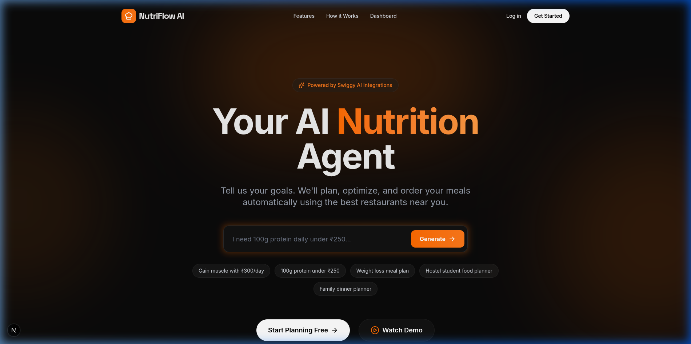
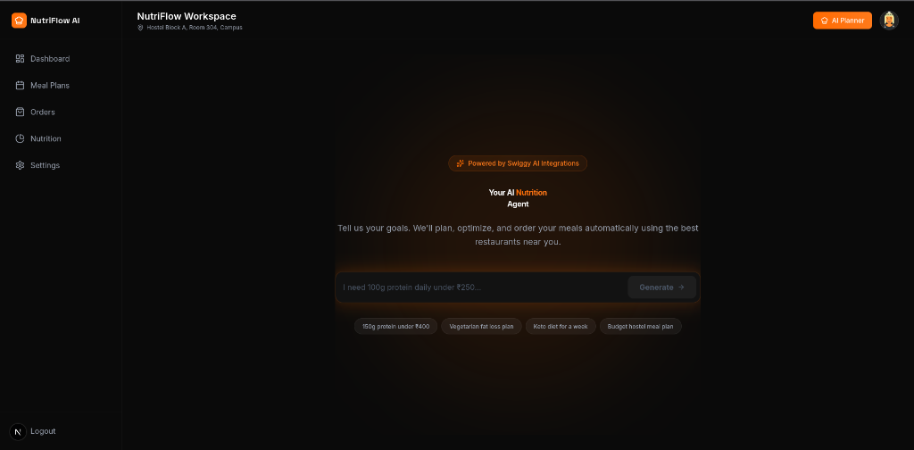

# 🥗 NutriFlow AI

> Your intelligent nutrition agent powered by Gemini AI and integrated with Swiggy.



NutriFlow AI is a modern, high-conversion SaaS platform that takes your dietary goals (macros, budget, preferences) and uses Google's Gemini AI to instantly generate optimized daily meal plans, complete with restaurant recommendations and cost breakdowns.

## ✨ Features

- **🧠 Intelligent Meal Planning**: Tell the AI your budget and macro goals (e.g., "150g protein under ₹400") and get a complete breakfast, lunch, and dinner plan.
- **🔐 Secure Authentication**: Full email/password authentication and protected routes powered by Supabase Auth.
- **⚡ Real-time AI Generation**: Lightning-fast structured JSON parsing powered by Google Generative AI (`gemini-flash-latest`).
- **🎨 Premium Dark UI**: Stunning, glassmorphism-inspired dark mode interface built with Tailwind CSS and Framer Motion.
- **📱 Fully Responsive**: Flawless experience across desktop, tablet, and mobile devices.

## 📸 Screenshots

| Landing Page | AI Planner Dashboard |
|--------------|----------------------|
|  |  |

## 🚀 Quick Start Guide

Follow these steps to set up the project locally.

### 1. Clone the repository

```bash
git clone https://github.com/yourusername/nutriflow-ai.git
cd nutriflow-ai
```

### 2. Install dependencies

```bash
npm install
```

### 3. Set up Environment Variables

Create a `.env.local` file in the root directory and add your API keys:

```env
# Supabase Configuration
NEXT_PUBLIC_SUPABASE_URL=your_supabase_project_url
NEXT_PUBLIC_SUPABASE_ANON_KEY=your_supabase_anon_key

# Google AI Studio Configuration
GEMINI_API_KEY=your_gemini_api_key
```

*Note: For local testing, ensure Email Confirmation is disabled in your Supabase Auth settings to bypass the free-tier email limit.*

### 4. Run the Development Server

```bash
npm run dev
```

Open [http://localhost:3000](http://localhost:3000) with your browser to see the result.

## 🛠️ Tech Stack

- **Framework**: [Next.js 15](https://nextjs.org/) (App Router)
- **Styling**: [Tailwind CSS](https://tailwindcss.com/)
- **Animations**: [Framer Motion](https://www.framer.com/motion/)
- **Authentication**: [Supabase](https://supabase.com/)
- **AI**: [Google Generative AI SDK (Gemini)](https://ai.google.dev/)
- **Icons**: [Lucide React](https://lucide.dev/)

## 📝 License

This project is licensed under the MIT License.
