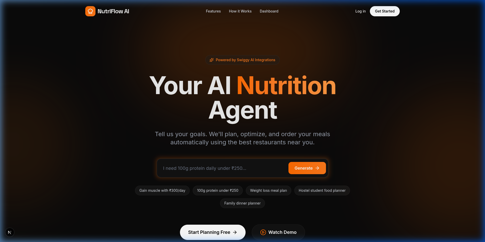
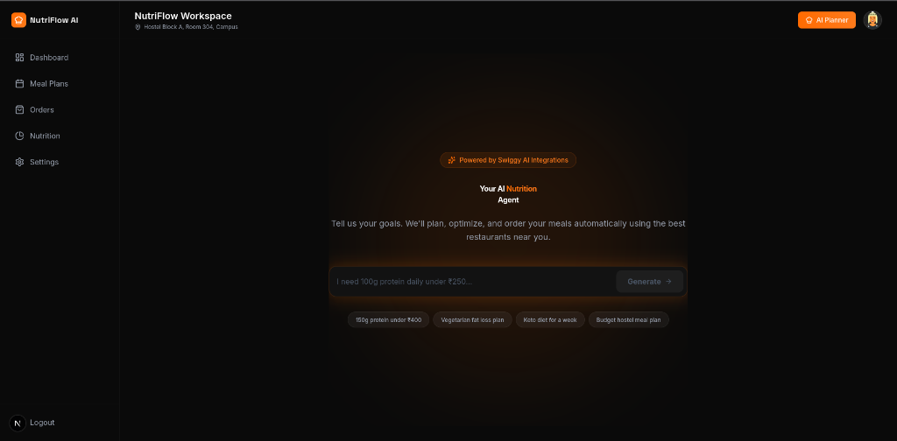

# 🥗 NutriFlow AI

> A prototype for Gemini-assisted daily meal planning. No ordering or live restaurant integration.

[View the live application](https://nutriflowai.vercel.app)



NutriFlow AI uses Gemini to draft one day of breakfast, lunch, and dinner ideas from a goal or budget. Nutrition and costs are AI estimates, not verified restaurant menus or live prices. Users can save the latest generated plan in their browser; it does not sync between devices.

## ✨ Features

- **🧠 Intelligent Meal Planning**: Tell the AI your budget and macro goals (e.g., "150g protein under ₹400") and get a complete breakfast, lunch, and dinner plan.
- **🔐 Secure Authentication**: Full email/password authentication and protected routes powered by Supabase Auth.
- **⚡ Gemini generation**: The server requests a structured meal-plan draft from the Gemini API. A valid API key is needed.
- **🎨 Dark UI**: Built with Tailwind CSS and Framer Motion.
- **📱 Responsive layout**: Includes desktop and mobile navigation; test on your device before relying on it.

## 📸 Screenshots

| Landing Page | AI Planner Dashboard |
|--------------|----------------------|
|  |  |

## 🚀 Quick Start Guide

Follow these steps to set up the project locally.

### 1. Clone the repository

```bash
git clone https://github.com/ASHLIN-BIJU/NutriFlow-AI.git
cd NutriFlow-AI
```

### 2. Install dependencies

```bash
npm install
```

### 3. Set up Environment Variables

Create a `.env.local` file in the root directory and add your API keys:

```env
# Supabase Configuration
NEXT_PUBLIC_SUPABASE_URL=your_supabase_project_url
NEXT_PUBLIC_SUPABASE_ANON_KEY=your_supabase_anon_key

# Google AI Studio Configuration
GEMINI_API_KEY=your_gemini_api_key
```

*Email confirmation can stay enabled. Set the Supabase Auth Site URL and redirect allow list to the callback URL for your environment; verify that email sign-in returns to the app.*

### 4. Run the Development Server

```bash
npm run dev
```

Open [http://localhost:3000](http://localhost:3000) with your browser to see the result.

## 🛠️ Tech Stack

- **Framework**: [Next.js 16](https://nextjs.org/) (App Router)
- **Styling**: [Tailwind CSS](https://tailwindcss.com/)
- **Animations**: [Framer Motion](https://www.framer.com/motion/)
- **Authentication**: [Supabase](https://supabase.com/)
- **AI**: [Google Generative AI SDK (Gemini)](https://ai.google.dev/)
- **Icons**: [Lucide React](https://lucide.dev/)

## 📝 License

This project is licensed under the MIT License.
